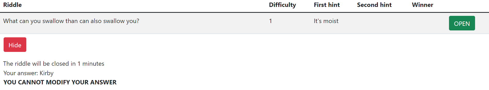
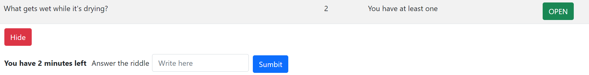

# Exam2-Riddles - 2022 Course 2 WA1 JZ-ZZ

## Student:

- RICCARDO LUCIFORA

## React Client Application Routes

- Route `/`: main page where all the operations take place (handling riddles, viewing user ranking)
- Route `/login`: login page, where the users insert their credentials
- Route `*`:  default route

## API Server

Here you can see the designed HTTP APIs for the project.

### **List All Riddles**

URL: `/api/riddles`

Method: GET

Description: Get all the riddles.

Request body: _None_

Response: `200 OK` (success) or `500 Internal Server Error` (generic error).

Response body: An array of Riddle objects, each describing a riddle.

```
[{
    "creatorid": 1,
	"questionid": 1,
	"question": "What can you swallow than can also swallow you?"
	"difficulty": 1,
	"duration": 120,
	"response": "Water", 
	"hint1": "It's moist",
	"hint2": "You cannot live without it",
	"open": 1,
	"winner": null,
	"time": null,
}, {
    "creatorid": 2,
	"questionid": 1,
	"question": "What gets wet while it's drying?"
	"difficulty": 2,
	"duration": 240,
	"response": "Towel", 
	"hint1": "You have at least one",
	"hint2": "You use it everyday",
	"open": 1,
	"winner": null,
	"time": null
},
...
]
```

### **List User Answer**

URL: `/api/answer`

Method: GET

Description: Get all the answers given by the current user.

Request body: _None_

Response: `200 OK` (success) or `500 Internal Server Error` (generic error).

Response body: An array of objects, each describing an answer.

```
[{
    "creatorid": 1,
	"questionid": 1,
	"userid": 2,
	"answer": "Bubblegum"
}, {
    "creatorid": 3,
	"questionid": 1,
	"userid": 2,
	"answer": "A rocket"
}
},
...
]
```

### **List All Answers**

URL: `/api/answers`

Method: GET

Description: Get all the answers to all the riddles.

Request body: _None_

Response: `200 OK` (success) or `500 Internal Server Error` (generic error).

Response body: An array of objects, each describing an answer.

```
[{
    "creatorid": 1,
	"questionid": 1,
	"userid": 2,
	"answer": "Bubblegum"
}, {
    "creatorid": 3,
	"questionid": 1,
	"userid": 3,
	"answer": "A rocket"
}
},
...
]
```

### **List All Answers**

URL: `/api/ranking`

Method: GET

Description: Get all the users ranked by score.

Request body: _None_

Response: `200 OK` (success) or `500 Internal Server Error` (generic error).

Response body: An array of objects, each describing an answer.

```
[{
    "id": 1,
	"username": "riccardorossi",
	"score": 0,
	"rank": 1
}, {
    "id": 2,
	"username": "valentinaverdi",
	"score": 0,
	"rank": 1
}
},
...
]
```

### **Post new answer**

URL: `/api/answer`

Method: POST

Description: Add a new answer to the list of answers.

Request body: An object representing an answer, without userid because it will be given by isLoggedIn middleware.

```
[
    {
	"creatorid": 1,
	"questionid": 1,
	"answer": "Bubblegum"
    }
]
```

### **Post new riddle**

URL: `/api/riddle`

Method: POST

Description: Add a new riddle to the list of riddles.

Request body: An object representing a riddle, without open (1 by default), winner and time (null by default), userid (taken from isLoggedIn middleware).

```
[
	{
	"questionid": 1,
	"question": "What can you swallow than can also swallow you?"
	"difficulty": 1,
	"duration": 120,
	"response": "Water", 
	"hint1": "It's moist",
	"hint2": "You cannot live without it",
	}
]
```

Response: `201 OK` (success) or `503 Service Unavailable` (generic error).

Response body: _None_

### **Set a riddle as closed**

URL: `/api/close`

Method: PUT

Description: Mark a riddle as closed.

Request body: An object representing a riddle identifier.

```
[
    {
    "creatorid": 1,
    "question": 1,
    }
]
```

Response: `201 OK` (success) or `503 Service Unavailable` (generic error).

Response body: _None_

### **Set riddle starting time or riddle winner**

URL: `/api/time`

Method: PUT

Description: Set timestamp (to enable the timer to start) if not null, else set winner (current user, given by isLoggedIn).

Request body: An object representing a timestamp (optional) and a riddle identifier.

```
[
    {
    "timestamp": "Thu, 07 Jul 2022 16:29:22 GMT", 
	"creatorid": 1, 
	"questionid": 1
    }
]
```

```
[
    {
    "timestamp": null, 
	"creatorid": 1, 
	"questionid": 1
    }
]
```

Response: `201 OK` (success) or `503 Service Unavailable` (generic error).

Response body: _None_

### **Add score to winner or set riddle id**

URL: `/api/score`

Method: PUT

Description: Set timestamp (to enable the timer to start) if not null, else set winner (current user, given by isLoggedIn).

Request body: An object representing a score (optional) and a flag (always 1).

```
[
    {
	"score": 2,
	"question": null
    }
]
```

```
[
    {
	"score": null,
	"question": 1
    }
]
```

Response: `201 OK` (success) or `503 Service Unavailable` (generic error).

Response body: _None_


## List of APIs offered by the server for User management

Hereafter, we report the designed HTTP APIs, also implemented in the project.

### **Login**

URL: `/api/sessions`

Method: POST

Description: Send credentials in order to login a user.

Request body: An object containing user credentials.

```
{
    "username": "riccardorossi"
    "password": "password"
}

```

Response: `200 OK` (success) or `401 Unauthorized` (Unauthenticated user).

Response body: A string message explaining what is going on.

### **Logout**

URL: `/api/sessions/current`

Method: DELETE

Description: Send credentials in order to login a user.

Request body: _None_

Response: `200 OK` (success) or `500 Generic Error` (generic error).

Response body: _None_

### **Get User Infos**

URL: `/api/sessions/current`

Method: GET

Description: Get current user informations to be used along the routes.

Request body: _None_

Response: `200 OK` (success) or `401 Unauthorized` (Unauthenticated user).

Response body: An object with username informations

```
{
    "username": "riccardorossi"
    "password": "password"
}

```
## Database Tables

- Table `user` - contains id, username, password, salt, score, question
- Table `riddle` - contains creatorid, questionid, question, diffuclty, duration, response, hint1, hint2, open, winner, time
- Table `answer` - contains creatorid, questionid, userid, answer

## Main React Components

- `AuthComponents` (in `AuthComponents.js`): it handles authentication (and in particular the login view and logout button)
- `MyNavbar` (in `MyNavbar.js`): a simple navbar with a title, a logo and two buttons (login and logout)
- `RiddleView` (in `RiddleView.js`): it coordinates the different views. It calls AuthComponents, MyNavbar, RiddleTable
- `RiddleTable` (in `RiddleTable.js`): it renders all the main elements (the riddles, the filters buttons, the creation form, the user ranking)
## Screenshot

Seeing a hint after due time (answer already given):

Seeing a hint after due time (answer not given yet):


## Users Credentials:

These are the users already present in the database, for testing purposes

- 1. username: "riccardorossi" , password: "password"
- 2. username: "valentinaverdi" , password: "password"
- 3. username: "biagioblu", password: "password"
- 4. username: "giannagialli", password: "password"
- 5. username: "giorgiogrigi", password: "password"
